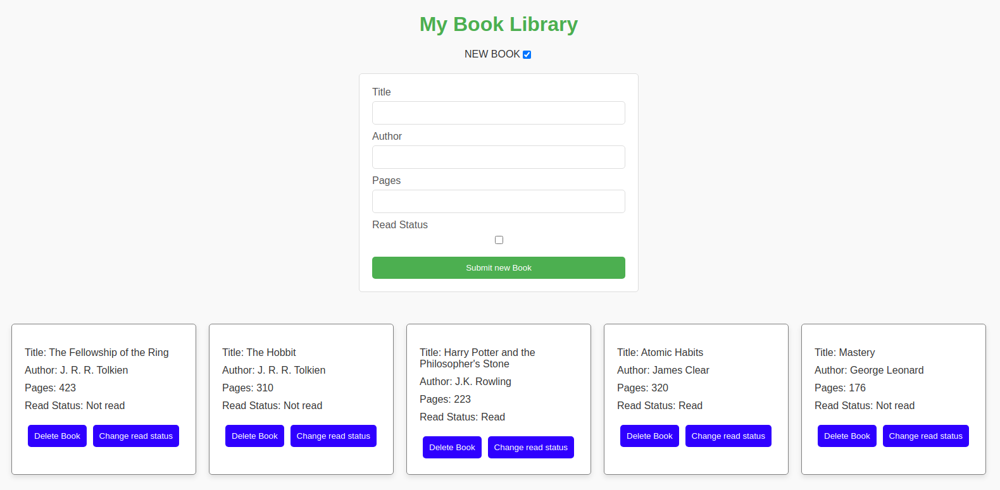

# 📚 Library

This project is part of **The Odin Project's JavaScript curriculum**, where I created a simple **Library** application to manage a collection of books. The project allows users to add, remove, and view books, enhancing my understanding of JavaScript, DOM manipulation, and data management.

## 🌟 Features

- Add new books with title, author, and read status.
- Remove books from the library.
- View a list of all books added to the library.
- Toggle the read status of each book.

## 🚀 Technologies Used

- **HTML5**: For structuring the library interface and book entries.
- **CSS**: For styling the library layout and book elements.
- **JavaScript**: For implementing the logic for adding, removing, and managing books in the library.

## 📸 Preview

You can view the Library application here: [Live Demo](https://mrswizzer.github.io/odin-books-library)

## 💡 Learning Outcomes

Through this project, I practiced the following skills:

- Creating a dynamic user interface with **JavaScript** for managing books.
- Using **DOM manipulation** to add and remove elements from the webpage.
- Understanding the basics of object-oriented programming by creating a `Book` constructor.
- Managing application state and user interactions effectively.

---

## 🔗 Acknowledgments

This project was built as part of [The Odin Project](https://www.theodinproject.com/)'s curriculum.
